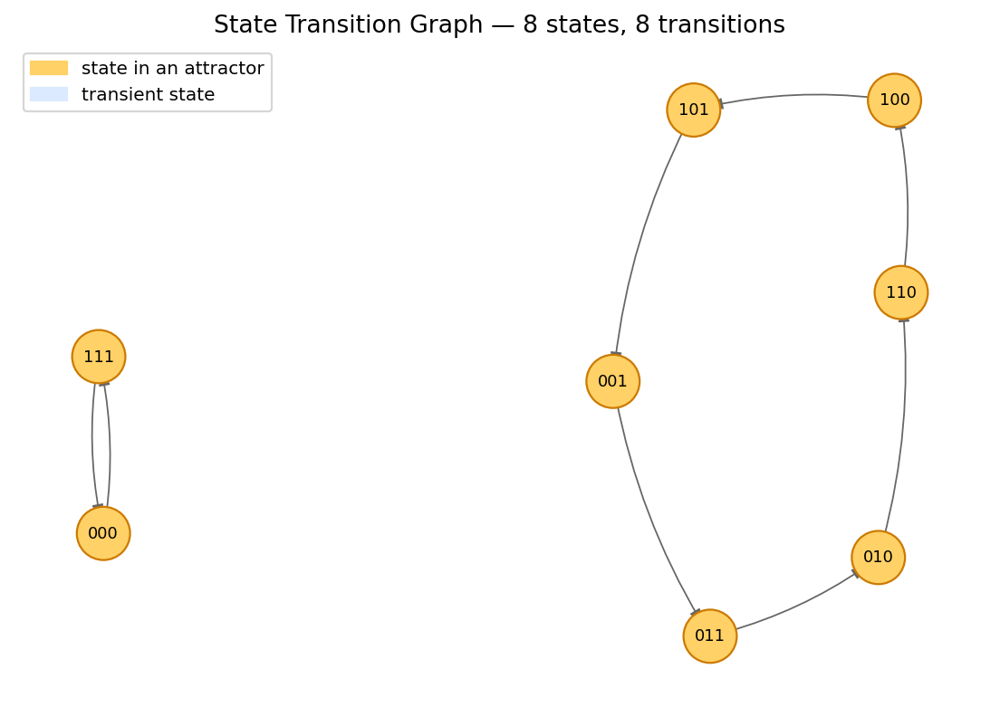

# Boolean Network Analyzer

> **Capstone Project P6** &mdash; HCMUT, Faculty of Computer Science & Engineering
> *Đồ án Tổng hợp - hướng Trí tuệ Nhân tạo*
> Author: **Tran Phan Dang Khoi** (Student ID 2352626)

A Python toolkit **and a fully in-browser live demo** for parsing, simulating, and
analyzing Boolean networks. Implements every requirement of the assignment:

1. Import a Boolean network from a `.bnet` file
2. Visualize the influence graph (with sign-annotated edges)
3. Build the state-transition graph under both **synchronous** and
   **asynchronous** update schemes
4. Compute every attractor (fixed point, cyclic, complex) and its basin

> **▶ Live demo (no install):** The demo runs entirely in your browser (pure HTML +
> JavaScript) and is available at:
> - **GitHub Pages:** `https://<your-username>.github.io/<repo-name>/app.html` (if deployed)
> - **Local http-server:** `python -m http.server --directory docs 8000` then visit
>   `http://localhost:8000/app.html`
>
> The parser, STG construction, Tarjan SCC, and attractor classification all run
> client-side. Verified against the Python reference engine on all five bundled
> samples (synchronous *and* asynchronous): every attractor — kind, size, and
> member states — matches.



---

## Try the demo

**Option 1: Online (if deployed to GitHub Pages)**

Visit `https://<your-username>.github.io/<repo-name>/app.html` (see
*Deploy the landing page* section below).

**Option 2: Local http-server (no setup required)**

```bash
# Clone the repository
git clone https://github.com/<your-username>/boolean-network-analyzer.git
cd boolean-network-analyzer

# Start a local web server
python -m http.server --directory docs 8000
```

Then open <http://localhost:8000/app.html> in your browser. Pick a sample or
upload your own `.bnet` file.

**Option 3: Use the Python API**

For programmatic analysis, see *Programmatic use* below.

## Repository layout

```
.
├── src/bnanalyzer/              # Core engine (importable Python package)
│   ├── parser.py                # .bnet parser
│   ├── network.py               # BooleanNetwork class + influence graph
│   ├── stg.py                   # State-transition graph (sync & async)
│   ├── attractors.py            # Attractor / basin computation
│   └── visualize.py             # matplotlib drawing helpers
├── samples/                     # Example .bnet networks
├── tests/                       # pytest unit tests (23 tests)
├── docs/                        # GitHub Pages landing site (/docs)
├── Report/                      # Capstone report (.docx)
├── Slide/                       # Defense slide deck (.pptx)
├── requirements.txt
└── LICENSE                      # MIT
```

## Bundled sample networks

| File                          | Nodes | About                                                                 |
|-------------------------------|------:|-----------------------------------------------------------------------|
| `toy_switch.bnet`             |     3 | Pedagogical example with a single fixed-point attractor.              |
| `bistable_toggle.bnet`        |     2 | Mutual repression &mdash; two stable steady states (Gardner *et al.* 2000). |
| `repressilator.bnet`          |     3 | Cyclic mutual repression &mdash; synchronous cycle of length 6.       |
| `fission_yeast.bnet`          |     9 | Reduced *S. pombe* cell-cycle (Davidich & Bornholdt 2008).            |
| `mammalian_cell_cycle.bnet`   |    10 | Reduced mammalian cell-cycle (Faure *et al.* 2006).                   |

## The `.bnet` format

A plain-text format (compatible with PyBoolNet/BoolNet) where each non-empty,
non-comment line declares the update rule of one node:

```
target, expression
```

Operators: `!` (NOT), `&` (AND), `|` (OR), parentheses, plus the constants
`0`, `1`, `True`, `False`. The header line `targets, factors` is optional
and ignored.

```bnet
# Bistable toggle switch
targets, factors
A, !B
B, !A
```

## Programmatic use

```python
from bnanalyzer import BooleanNetwork, build_state_transition_graph, find_attractors

net = BooleanNetwork.from_file("samples/repressilator.bnet")
print(net.summary())

stg_sync = build_state_transition_graph(net, scheme="synchronous")
attractors = find_attractors(stg_sync, scheme="synchronous")
for a in attractors:
    print(a.kind, a.labels(net))
```

## Running the tests

To run the test suite, you'll need the Python dependencies:

```bash
# Create and activate a virtual environment
python -m venv .venv
source .venv/bin/activate         # on Windows: .venv\Scripts\activate

# Install dependencies
pip install -r requirements.txt

# Run the tests
PYTHONPATH=src pytest -v
```

The suite exercises the parser, the influence-graph sign inference, both
update schemes on the bistable toggle and the repressilator, and basic
sanity checks on every bundled sample.

## Deploy the landing page & live demo (GitHub Pages)

The `docs/` folder is a self-contained static site that contains:

- `index.html` &mdash; project landing page with screenshots and info.
- `app.html` &mdash; the interactive **live demo** (no install, no backend).
- `img/` &mdash; bundled figures.

Two deployment options are supported:

**Option A &mdash; GitHub Actions (recommended).** A workflow file is
already shipped at `.github/workflows/pages.yml`. After pushing to
`main`, open *Settings &rarr; Pages* and set **Source** to
*GitHub Actions*. Every push that touches `docs/` automatically rebuilds
the site.

**Option B &mdash; "deploy from a branch".** Open *Settings &rarr; Pages*,
set **Source** to *Deploy from a branch* and **Branch** to `main` /
folder `/docs`. (Either option ends up at the same URL.)

Once deployed, the live demo is reachable at
`https://<your-username>.github.io/<repo-name>/app.html` and the landing
page at `https://<your-username>.github.io/<repo-name>/`.

## References

- Schwab, J. D. *et al.* "Concepts in Boolean network modeling: What do
  they all mean?" *Computational and Structural Biotechnology Journal*,
  18 (2020): 571&ndash;582.
- Naldi, A. *et al.* "Logical modelling of regulatory networks with GINsim
  2.3." *BioSystems*, 97(2) (2009): 134&ndash;139.
- Klarner, H. *et al.* "PyBoolNet: A python package for the generation,
  analysis and visualization of Boolean networks." *Bioinformatics*, 33(5)
  (2017): 770&ndash;772.

## License

MIT &mdash; see [LICENSE](LICENSE).
